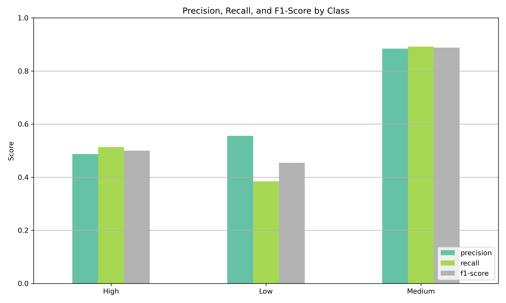

## Wine Quality Classification

Project Overview
This project aims to classify wine quality into three categories: Low, Medium, and High based on physicochemical properties using machine learning techniques.

## Dataset
The dataset contains **11 physicochemical features** of red wine samples, with a target variable `quality` (integer values from 3 to 8).  
Due to class imbalance and limited range, quality scores were grouped into three categories:

- **Low** (quality ≤ 4)
- **Medium** (quality 5–6)
- **High** (quality ≥ 7)

## Methodology
- Data preprocessing (handling duplicates, encoding labels)
- Exploratory Data Analysis (EDA)
- Balancing classes with SMOTE
- Modeling with XGBoost
- Performance evaluation using classification report and confusion matrix

## 📈 Classification Report:

| Class  | Precision | Recall | F1-score | Support |
|--------|-----------|--------|----------|---------|
| High   | 0.49      | 0.51   | 0.50     | 37      |
| Low    | 0.56      | 0.38   | 0.45     | 13      |
| Medium | 0.88      | 0.89   | 0.89     | 222     |
|        |           |        |          |         |
| **Accuracy** |       |        | **0.82** | 272     |

## 📊 Confusion Matrix

## 📊 Classification Report (Barplot)

## How to Run
1. Clone the repository  
2. Install dependencies: `pip install -r requirements.txt`  
3. Run the notebook/script

## Results
- Accuracy: 82%  
- Best performance on Medium quality wines

## License
MIT License
